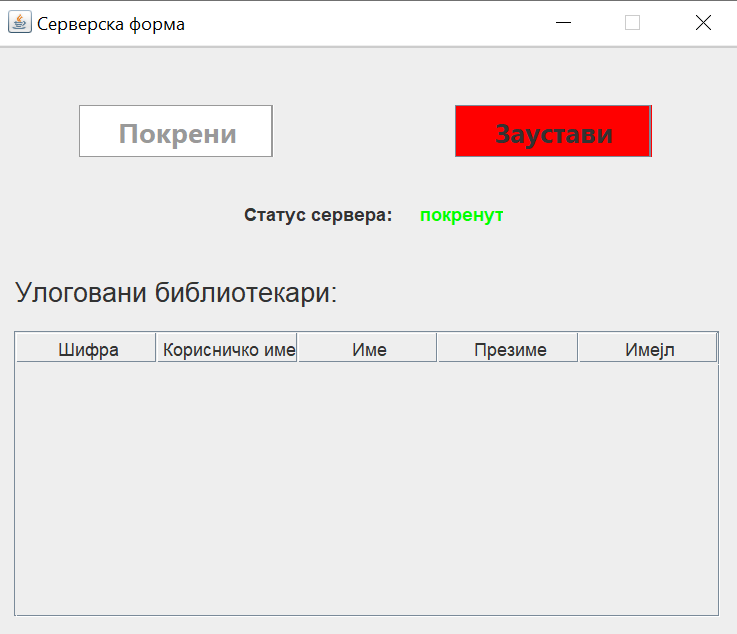
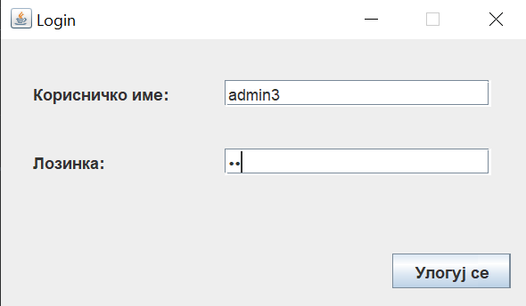
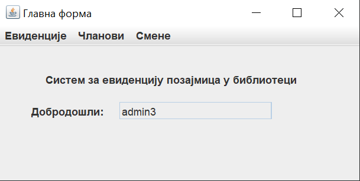
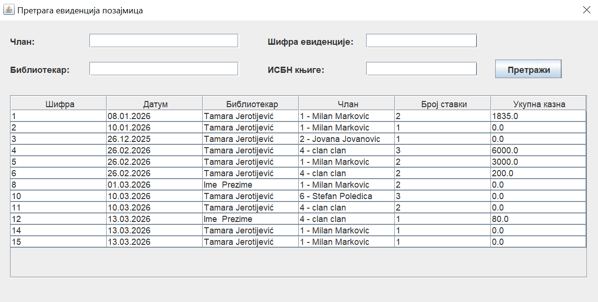
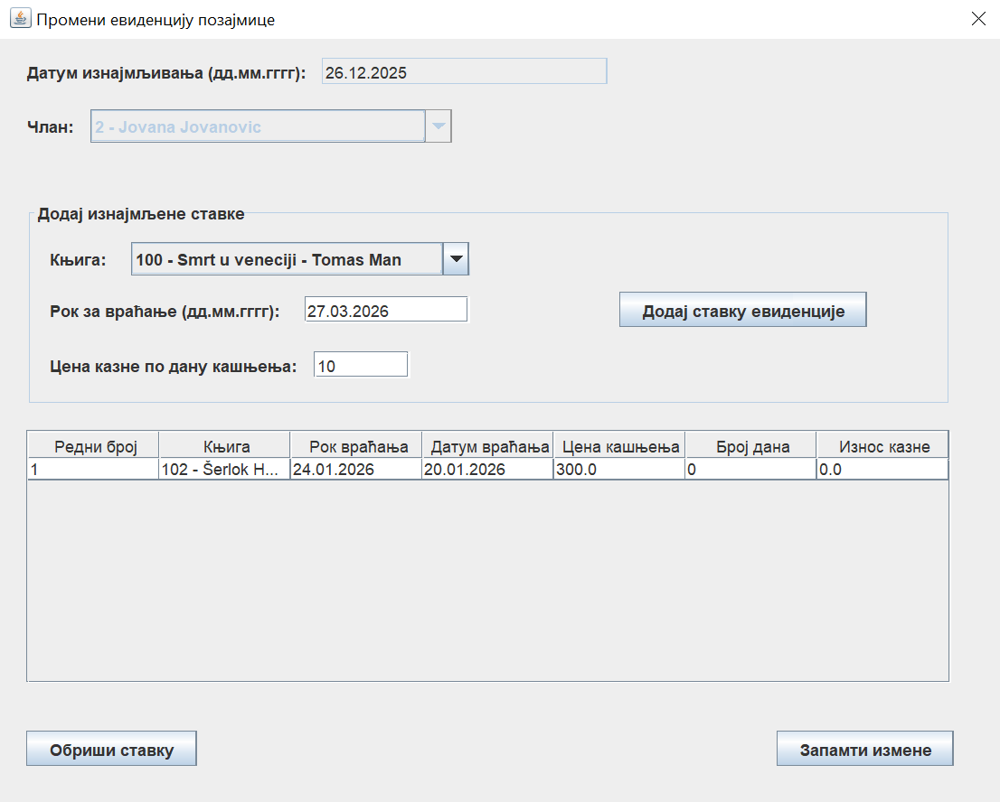

# Library Management System

## Screenshots

## Library Management System

A client-server application developed in Java for managing book loans in a library.

The system enables librarians to efficiently manage members, books, loan records, and shifts through a graphical user interface.

## Technologies

- Java
- Java Swing (Graphical User Interface)
- Java Sockets (Client-Server communication)
- JDBC
- MySQL
- NetBeans

## Features

- User authentication
- Library member management
- Loan record management
- Loan item management
- Shift management
- Search functionality
- Create, update and delete operations (CRUD)
- Input validation and business rule checks
- Database integration

## Architecture

The application follows a client-server architecture:

- Client application - provides the graphical user interface using Java Swing and allows users to interact with the system.
- Server application - handles business logic, processes client requests, manages transactions, and communicates with the database.
- Database - stores information about books, members, librarians, loans, and shifts.

Communication between the client and server is implemented using Java sockets.

## Database Model

The system manages the following main entities:

- Librarian
- Library member
- Book
- Loan record
- Loan item
- Shift
- Location

The relationships between entities allow the system to track which books are borrowed, by whom, and which librarian processed each loan.

## Key Implementation Details

- Object-oriented design using Java classes, inheritance, and abstraction
- Multi-layer application structure
- Client-server communication through sockets
- Database operations using JDBC
- Transaction management and controlled exception handling
- Validation of user input and business rules

## What I Learned

Through this project I gained experience with:

- Developing client-server applications
- Working with Java networking and sockets
- Building desktop applications with Java Swing
- Connecting Java applications with relational databases
- Applying object-oriented programming concepts
- Designing multi-layer software systems
- Implementing CRUD operations and validation logic
- Understanding the challenges of maintaining communication between different parts of a software system